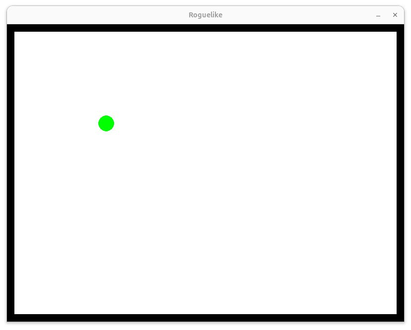
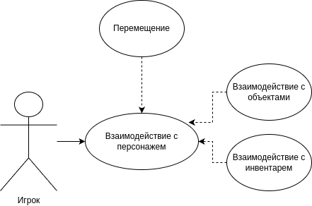
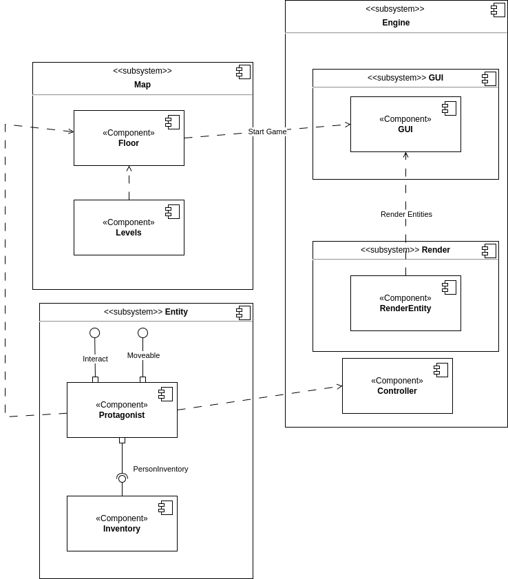
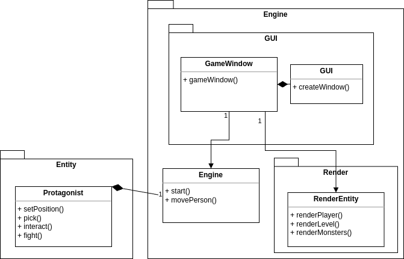
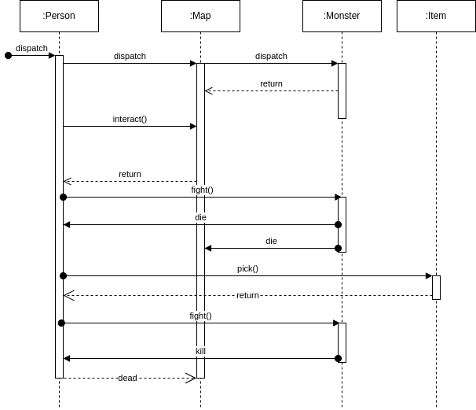
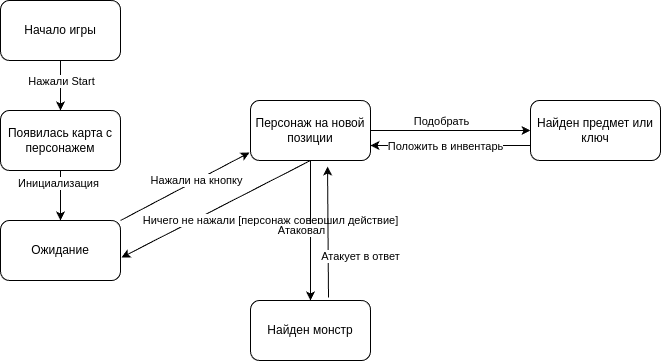

# Roguelike

### Репозиторий проекта по курсу СПбГУ МКН РПО «Архитектура и проектирование информационных систем»

**Roguelike** — игра в жанре рогалик, написанная на Python.

---

## Обзор

На текущем этапе проект представляет собой реализацию архитектуры, созданной для дальнейшей разработки игры. 

Минимальная функциональность: перемещение зелёного шарика по экрану с использованием клавиш-стрелок.
---

## Зависимости

Для работы проекта требуются следующие библиотеки и модули Python:

- **`unittest`** — модуль для написания и выполнения тестов.
- **`sys`** — модуль для работы с параметрами командной строки и взаимодействия с интерпретатором.
- **`pygame`** — библиотека для создания игр и мультимедиа-приложений.

Перед запуском необходимо установить модуль `pygame`:

```bash
pip install pygame
```

---

## Запуск тестов

Для выполнения тестов выполните команды:

```bash
python3 -m unittest tests/engineTest.py
python3 -m unittest tests/gameWindowTest.py
python3 -m unittest tests/renderEntity.py
```

---

## Запуск Roguelike

Для запуска игры выполните:

```bash
python3 main.py
```

---

## Команда разработки

Проект разработан в рамках курса «Архитектура и проектирование информационных систем» студентами факультета математики и информатики Санкт-Петербургского государственного университета:

- [Mark Bezmaslov](https://github.com/mark47B)
- [Viktor Zakharov](https://github.com/vatican1)

---

## Внешний вид данной версии



---
## Диаграмма вариантов исопльзования


На usecase диаграмме отображены основные варианты использования системы игроком: 

1. Перемещение
Игрок управляет перемещением персонажа по игровому полю. Этот вариант использования связан с базовыми действиями в игре.

2. Взаимодействие с персонажем
Игрок может выполнять действия, связанные с управлением персонажем, такие как атака, защита или использование навыков. Этот процесс является центральным элементом взаимодействия.

3. Взаимодействие с объектами
Игрок имеет возможность взаимодействовать с игровыми объектами, например, собирать предметы или активировать элементы окружения. Это расширяет возможности игрока в исследовании игрового мира.

4. Взаимодействие с инвентарем
Игрок может просматривать, использовать или изменять содержимое инвентаря, включая экипировку, зелья или другие предметы. Этот функционал тесно связан с игровым процессом.

## Композиция (диаграмма компонентов)



Диаграмма компонентов отражает связи между игровой логикой, интерфейсом и персонажем.

- **Engine** — отвечает за инициализацию карты и объектов.
- **GUI** — отображает элементы на экране.
- **Person** — управляет логикой персонажа.
- **GameLogic** — обрабатывает взаимодействия объектов на карте.

---

## Логическая структура (диаграмма классов)



Диаграмма классов описывает отношения между компонентами системы:  
**Map** может существовать автономно, но без **GameWindow** не способен запустить игровой цикл.

---

## Взаимодействия и состояния  

### Диаграмма последовательностей



Рассматривается сценарий, где после появления персонажа загружаются карта и монстр. Персонаж может:

- Взаимодействовать с картой.
- Атаковать монстра, инициируя его жизненный цикл.
  
Если персонаж погибает, игровой цикл прекращается.

---

### Диаграмма конечных автоматов



FSM с поведением персонажа при взаимодействии с монстром, предметами и перемещением по карте.